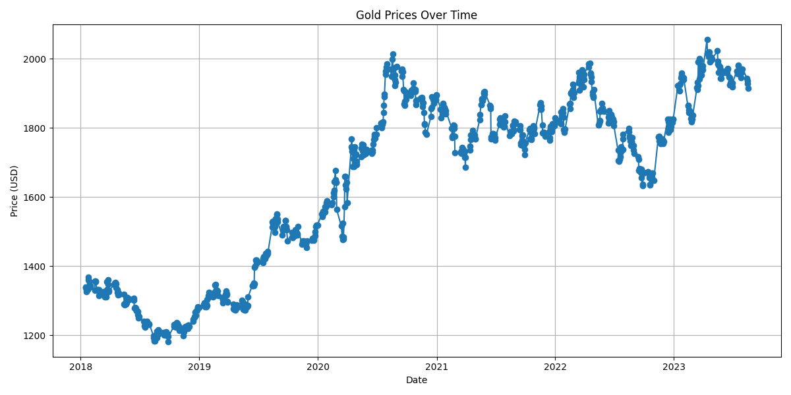
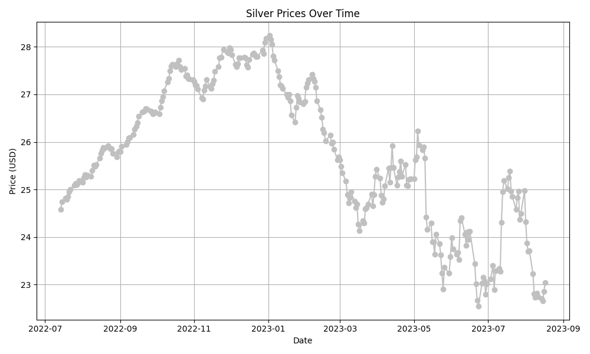

# Gold & Silver Price Analysis (2018–2023)
---

## Overview
This project analyzes 5 years of historical gold and silver price data (2018–2023), exploring trends and statistical relationships between the two commodities.

Pearson Correlation Coefficient between Gold and Silver Prices: -0.5869
This suggests that there is a moderate negative correlation between gold and silver prices. This means that as the price of gold tends to increase, the price of silver tends to decrease.
The negative sign (-) indicates the direction of the relationship. In this case, it suggests an inverse relationship between gold and silver prices. When gold prices go up, silver prices tend to go down, and when gold prices go down, silver prices tend to go up.

---

## Features

### Batch Analysis
- Cleaned and preprocessed historical gold and silver datasets.  
- Performed statistical correlation analysis using Pearson’s coefficient.  
- Visualized long-term price trends using matplotlib.

### Streaming Simulation
- Replayed historical data row by row with a delay to simulate live updates.  
- Computed incremental Pearson correlation on the fly.  
- Updated plots in real-time to demonstrate dynamic data flow.

---

## Key Learnings
- Difference between batch processing (full dataset at once) and row-wise streaming.  
- Demonstrated basic streaming concepts in Python without using heavy frameworks.  
- Built a minimal proof-of-concept pipeline for financial time-series analysis.

---

## Tech Stack
- **Languages:** Python (Pandas, NumPy)  
- **Visualization:** Matplotlib  
- **Concepts:** Batch vs. streaming, correlation analysis, real-time data simulation

---

## Future Extensions
- Integrate a real streaming system using Kafka or similar frameworks.  
- Scale to multiple commodities and live market feeds.  
- Connect to cloud-based data pipelines for real-time analytics.
